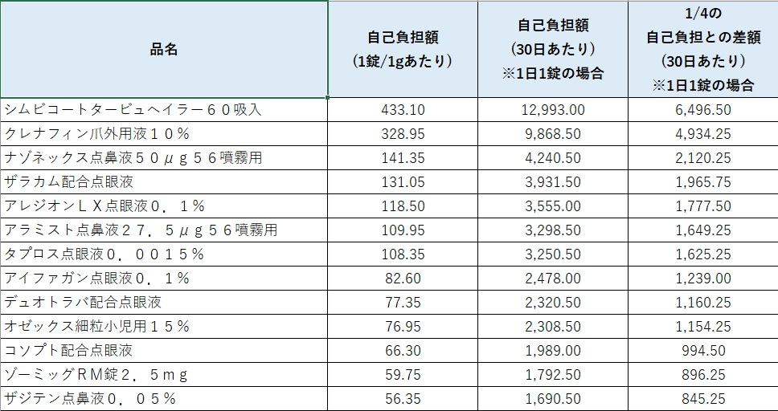

# Pharmacy CSV Matcher JP

Open-source Excel/VBA tooling for CSV matching workflows in Japanese community pharmacies.

## Why this project exists

Pharmacy CSV exports are often difficult to compare reliably in Excel. Product codes and JAN values can be converted to scientific notation, lose leading zeros, or be rounded during CSV/Excel handling.

Pharmacy CSV Matcher JP avoids using product codes as the primary matching key. Instead, it matches records using a normalized combination of:

```text
品名 + 規格容量 + メーカー
```

The goal is to reduce repetitive manual checking while keeping the workflow understandable and editable for pharmacy staff who already use Excel.

## What it does

The sample workflow compares three CSV files:

1. adopted item list
2. current inventory
3. target item list

Rows are exported to an Excel worksheet when all of the following are true:

- inventory quantity is greater than zero
- the item exists in the adopted item list
- the item exists in the target item list

The workbook also creates a matching log with counts for each stage.

## Features

- Excel/VBA only; no external runtime required
- matches by normalized product name, package size, and manufacturer
- avoids fragile matching based only on JAN/product codes
- accepts common alternative CSV header names in Japanese and English
- restores Excel display settings if processing fails
- exports a human-readable result sheet and processing log
- includes dummy CSV files for demonstration and testing

## Supported header aliases

The current matcher recognizes several common alternatives and maps them to canonical fields.

| Canonical field | Examples of accepted aliases |
| --- | --- |
| 品名 | 商品名, 医薬品名, 薬品名, product name, item name, drug name |
| 規格容量 | 規格, 包装規格, specification, package size |
| メーカー | メーカー名, 製造会社, 製造販売元, manufacturer, maker |
| 在庫数 | 在庫数量, 数量, stock quantity, inventory quantity |
| 店舗 | 店舗名, 薬局名, store name, pharmacy name |
| 商品コード | 医薬品コード, JAN, JAN code, product code |

Exact support is implemented in `PharmacyCsvMatcher.bas`.

## Repository contents

```text
pharmacy_csv_matcher_sample/
├── PharmacyCsvMatcher.bas
├── README.md
├── sample_adopted_items.csv
├── sample_inventory.csv
└── sample_target_items.csv
```

All sample files contain dummy data only.

## How to use

1. Open Excel and create or open a macro-enabled workbook (`.xlsm`).
2. Open the VBA editor.
3. Import `pharmacy_csv_matcher_sample/PharmacyCsvMatcher.bas`.
4. Run `RunPharmacyCsvMatcher`.
5. Select the adopted-items CSV, inventory CSV, and target-items CSV when prompted.
6. Review the generated `突合結果` and `突合ログ` worksheets.

## Screenshots

### CSV file selection


### Output worksheet example



## Intended users

- community pharmacists
- pharmacy managers
- medical inventory administrators
- healthcare staff working with Excel-based CSV exports

## Project scope

This repository intentionally focuses on a narrow workflow: transparent CSV matching that can be reviewed and modified in standard Excel/VBA.

It is not intended to replace pharmacy dispensing systems, inventory platforms, or validated clinical software. Matching results should be reviewed before they are used for operational decisions.

## Privacy and safety

This repository does not include patient data, real pharmacy inventory data, real store information, purchasing conditions, or wholesaler-confidential data.

All CSV files and screenshots are demonstration data. Contributors should never submit real patient information or confidential business data.

## Development status

The project is under active maintenance. Current work focuses on:

- broader CSV header compatibility
- clearer validation and error handling
- reproducible test cases for different export formats
- documentation for non-technical Excel users

Roadmap work is tracked in GitHub Issues.

## Contributing

Bug reports, compatibility examples, documentation improvements, and focused pull requests are welcome. See `CONTRIBUTING.md` before submitting data samples or code changes.

## License

MIT License. See `LICENSE`.

---

## 日本語説明

Pharmacy CSV Matcher JP は、日本の薬局業務で発生しやすいCSV突合作業を支援するExcel/VBAツールです。

採用品CSV・在庫CSV・対象品目CSVを照合し、条件に一致した品目をExcelシートへ出力します。商品コードやJANはExcel上で指数表記、丸め、先頭ゼロ消失が起きることがあるため、主な突合キーには「品名 + 規格容量 + メーカー」を使用しています。

現在は、CSVごとの列名揺れに対応するため、「商品名」「医薬品名」「製造販売元」「在庫数量」などの代表的な別名も自動認識します。

このリポジトリには患者情報、実店舗の在庫データ、仕入条件、卸由来の非公開データは含めません。公開用サンプルはすべてダミーデータです。
